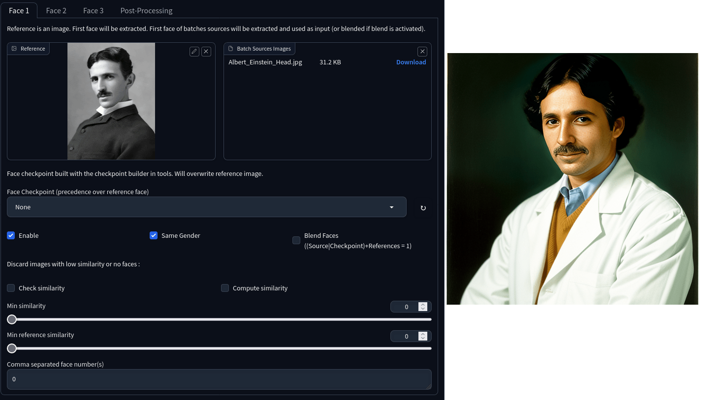

# FaceSwapLab for a1111/Vlad

Please read the documentation here : https://glucauze.github.io/sd-webui-faceswaplab/

FaceSwapLab is an extension for Stable Diffusion that simplifies face-swapping. It has evolved from sd-webui-faceswap and some part of sd-webui-roop. However, a substantial amount of the code has been rewritten to improve performance and to better manage masks.

Some key features include the ability to reuse faces via checkpoints, multiple face units, batch process images, sort faces based on size or gender, and support for vladmantic. It also provides a face inpainting feature.

While FaceSwapLab is still under development, it has reached a good level of stability. This makes it a reliable tool for those who are interested in face-swapping within the Stable Diffusion environment. As with all projects of this type, it’s expected to improve and evolve over time.

## Disclaimer and license

In short:

+ **Ethical Guideline:** This extension should not be forked to create a public, easy way to bypass NSFW filtering. If you modify it for this purpose, keep it private, or you'll be banned.
+ **License:** This software is distributed under the terms of the GNU Affero General Public License (AGPL), version 3 or later.
+ **Model License:** This software uses InsightFace's pre-trained models, which are available for non-commercial research purposes only.

More on this here : https://glucauze.github.io/sd-webui-faceswaplab/ 

### Known problems (wontfix):

+ Older versions of gradio don't work well with the extension. See this bug : https://github.com/glucauze/sd-webui-faceswaplab/issues/5

### Features

+ **Face Unit Concept**: Similar to controlNet, the program introduces the concept of a face unit. You can configure up to 10 units (3 units are the default setting) in the program settings (sd).

+ **Vladmantic and a1111 Support**

+ **Batch Processing**

+ **Inpainting Fixes** : supports “only masked” and mask inpainting.

+ **Performance Improvements**: The overall performance of the software has been enhanced.

+ **FaceSwapLab Tab**: providing various tools (build, compare, extract, batch)

+ **FaceSwapLab Settings**: FaceSwapLab settings are now part of the sd settings. To access them, navigate to the sd settings section.

+ **Face Reuse Via Checkpoints**: The FaceTools tab now allows creating checkpoints, which facilitate face reuse. When a checkpoint is used, it takes precedence over the reference image, and the reference source image is discarded.

+ **Gender Detection**: The program can now detect gender based on faces.

+ **Face Combination (Blending)**: Multiple versions of a face can be combined to enhance the swapping result. This blending happens during checkpoint creation.)

+ **Preserve Original Images**: You can opt to keep original images before the swapping process.

+ **Multiple Face Versions for Replacement**: The program allows the use of multiple versions of the same face for replacement.

+ **Face Similarity and Filtering**: You can compare faces against the reference and/or source images.

+ **Face Comparison**: face comparison feature.

+ **Face Extraction**: face extraction with or without upscaling.

+ **Improved Post-Processing**: codeformer, gfpgan, upscaling.

+ **Post Inpainting**: This feature allows the application of image-to-image inpainting specifically to faces.

+ **Upscaled Inswapper**: The program now includes an upscaled inswapper option, which improves results by incorporating upsampling, sharpness adjustment, and color correction before face is merged to the original image.

+ **API with typing support** :

## Installation

See the documentation here : https://glucauze.github.io/sd-webui-faceswaplab/